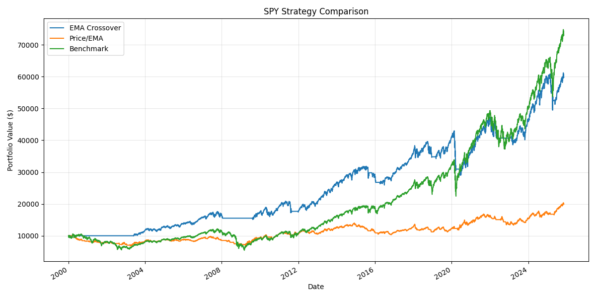
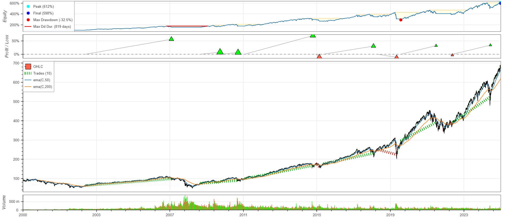
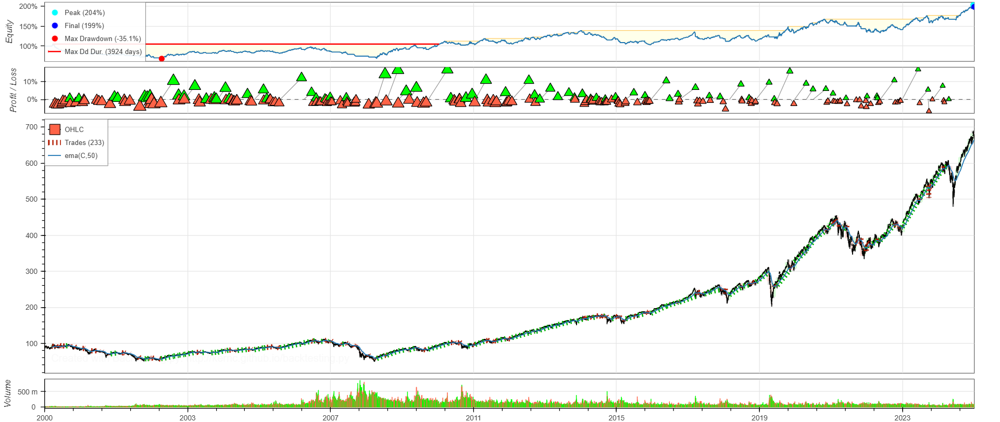

# Fortress Backtesting (Backtesting.py Edition)

A professional, modular Python backtesting system for rule-based strategies using **Backtesting.py** and **pandas_ta**.

## 📊 Strategies
- **EMA Crossover:** Fast/slow EMA cross detects major trend shifts.
- **Price/EMA Cross:** Buy/sell based on price crossing its EMA.

## ⚙️ Features
- Backtesting with transaction cost modeling  
- Performance metrics (Sharpe, Sortino, CAGR, Drawdown)  
- Exportable equity curve comparison  
- Modular design for adding more strategies  

## 🧠 Tech Stack
`Python`, `pandas`, `matplotlib`, `yfinance`, `pandas_ta`, `Backtesting.py`

## 🖼️ Sample Result
Equity Curves:

EMACrossover_Backtesting.py_Graph:

PriceCrossover_Backtesting.py_Graph:


## 🚀 Run the Project
```bash
pip install -r requirements.txt
python src/backtester.py
